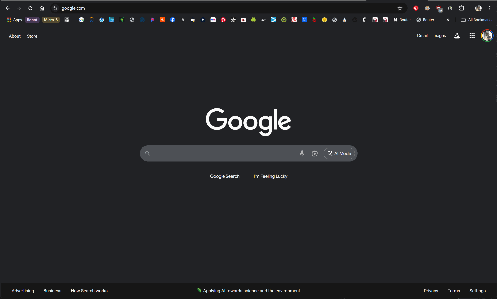

# Countdown Extension

## Background

I made a countdown timer that HR told me had most decidedly 'put their information at risk.'

The timer contains no proprietary data, it's the embodiment of vibe-coding with chatGPT and as a result is laughably bad.

Here's a visual example of what it does:

If you enjoy what's going on here, great! If not, that's fine too.